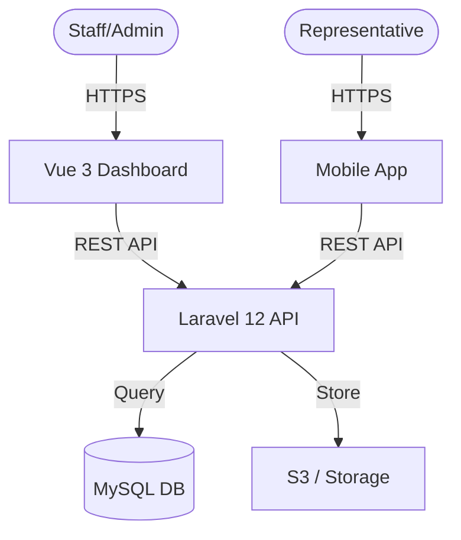

# System Architecture Overview

K-YEY Logistics is built with a modern, decoupled architecture designed for scale and reliability.

## Deployment Stack

- **Web Frontend**: Built with Vue 3 (Vite + TypeScript), deployed as a static SPA or integrated with Laravel's Vite plugin.
- **Backend API**: Laravel 12 on PHP 8.2+, following RESTful principles.
- **Mobile App**: Flutter, interacting with the same Laravel API.
- **Cache & Storage**: Redis (for cache/queues) and AWS S3 or Local File Storage for attachments.

## Data Flow Diagram (Conceptual)

## Security Layer

The system uses **Sanctum** for token-based authentication. Authorization is enforced at three levels:

1. **Gate Bypass**: Super Admin privilege for system-wide access.
2. **Explicit Permissions**: Spatie Permission + Controller-level logic.
3. **Data Scopes**: Row-level filtering based on User Role (Admin vs Shipper vs Client).
